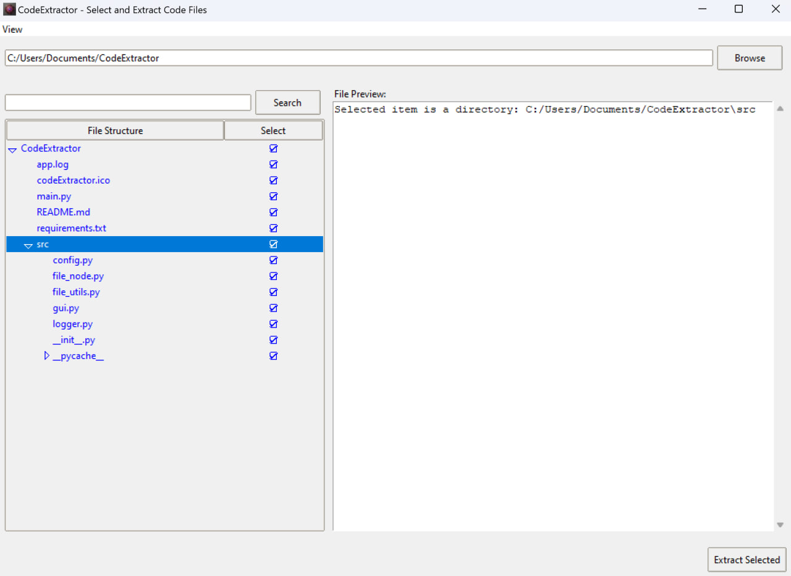
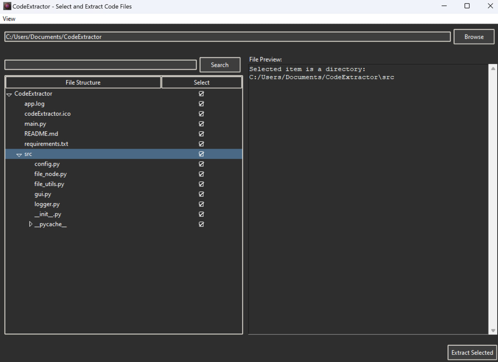

# CodeExtractor: File Selection and Extraction Tool

CodeExtractor is a powerful GUI application that allows users to select files and directories, view their structure, and extract contents into a single text file. It's particularly useful for preparing codebases for analysis by Large Language Models (LLMs) or for code review purposes.

## Features

- User-friendly graphical interface for browsing and selecting directories
- Interactive file structure visualization with a tree view
- Selective file and directory inclusion/exclusion
- Basic file filtering based on predefined code extensions
- Content extraction of selected files into a single text file
- Multi-threaded directory scanning and file extraction for improved performance
- File preview functionality
- Search capability within the file structure
- Dark mode support

Note: File filtering is currently based on a predefined set of code file extensions. CodeExtractor automatically identifies and processes common code file types.

## Prerequisites

- Python 3.6 or higher

## Installation

1. Clone this repository:

`git clone https://github.com/neozhijie/code-extractor.git `

`cd code-extractor`

2. Install the required dependencies:

`pip install -r requirements.txt`

## Usage

1. Run the application: `python main.py`

2. Use the "Browse" button to select a directory.
3. Navigate the file structure in the tree view, using checkboxes to select/deselect files and directories.
4. Use the search functionality to find specific files or directories.
5. Preview file contents by selecting a file in the tree view.
6. Click "Extract Selected" to save the contents of selected files to a single text file.

## Configuration

The list of recognized code file extensions is stored in `src/config.py`. You can modify this file to add or remove extensions as needed.

## Dependencies

- tkinter: GUI toolkit (usually comes pre-installed with Python)
- PyPDF2: PDF parsing library

## License

This project is licensed under the MIT License - see the [LICENSE](LICENSE) file for details.

## Troubleshooting

If you encounter any issues, please check the following:

1. Ensure all dependencies are installed correctly.
2. Check that you have the necessary permissions to read/write files in the selected directory.
3. For PDF-related issues, make sure you have the latest version of PyPDF2 installed.

If problems persist, please open an issue on the GitHub repository.

## Screenshots

